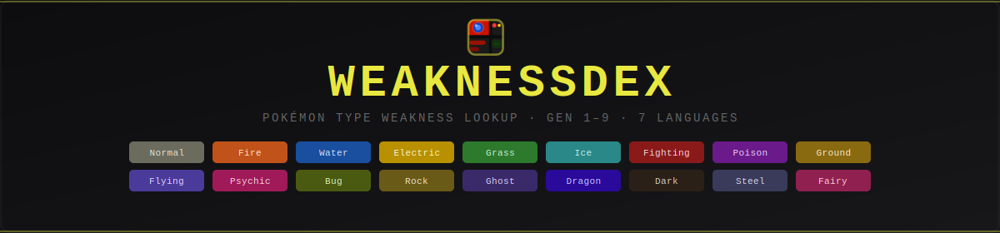

A fast Pokémon type weakness lookup tool. Search any Pokémon by name, see its full type matchup chart, abilities, evolution chain, and move list — across all generations and in 7 languages.

**Live:** [weakness-dex.hyvitech.org](https://weakness-dex.hyvitech.org)

## Features

- Type weakness/resistance/immunity chart for all 18 types
- Supports all generations (Gen 1–9) with correct historical type charts
- Ability override (Levitate, Wonder Guard, etc.) affects the chart in real time
- Shiny sprite toggle
- Regional form switching — Alolan, Galarian, Hisuian, Paldean variants shown as chips
- Base stat display with colored bars (Gen 1 uses single Special stat)
- Ability descriptions on hover; relevant abilities visually highlighted
- Evolution chain with sprites and branching paths
- Move list with tabs (level-up, TM, egg, tutor)
- Shareable URLs — the Share button copies a link encoding the current Pokémon, generation, ability, language, and shiny state
- Localized search and UI in 7 languages (EN, DE, FR, ES, IT, JA, KO)
- Keyboard shortcut: press `/` or `s` to focus the search box
- Lookup history
- All PokéAPI responses cached in `localStorage` — fast after the first load
- Installable as a PWA

## Running locally

No build step, no dependencies. Just open `index.html` in a browser:

```bash
# Option A — open directly
open index.html

# Option B — serve with any static server
npx serve .
python -m http.server 8080
```

## Docker

```bash
docker build -t weakness-dex .
docker run -p 8080:80 weakness-dex
```

Then visit `http://localhost:8080`.

## Self-hosting (Docker Compose + Nginx Proxy Manager)

The included `docker-compose.yml` is set up for NPM. Adjust the network name to match your NPM instance, then in NPM add a Proxy Host pointing to `weakness-dex:80`.

```bash
docker compose pull
docker compose up -d
```

The GitHub Actions workflow (`.github/workflows/deploy.yml`) builds and pushes to GHCR on every push to `master`. To use it for your own fork, update the image tag in `deploy.yml` and `docker-compose.yml` to your own GHCR path.

## Cloudflare Worker (share link previews)

The `worker/` directory contains a Cloudflare Worker that generates dynamic Open Graph previews for share links. For `?p=` links it injects the Pokémon's name, weaknesses, abilities, and BST as the description and generates a custom 1200×630 PNG card with the official artwork. The homepage also gets a branded splash card showing all 18 type badges.

Requires the domain to be proxied through Cloudflare (orange cloud).

```bash
cd worker
npm install
npx wrangler login   # first time only
npx wrangler deploy
```

Update `pattern` and `zone_name` in `worker/wrangler.toml` if you're deploying to a different domain.

## Forking

Feel free to fork and self-host. The project is intentionally simple — vanilla JS, no bundler, no framework. All logic lives in four files: `js/data.js`, `js/api.js`, `js/render.js`, `js/main.js`. See `CLAUDE.md` for a full architectural overview.

## License

[GNU General Public License v3.0](LICENSE)

## Credits

- Data from [PokéAPI](https://pokeapi.co)
- Built by [Xoudusz](https://github.com/Xoudusz) with the help of [Claude Code](https://claude.ai/code)